# Портал  «Едем, но это не точно» 

  
  
  
  
  
  
  
  
  
  

  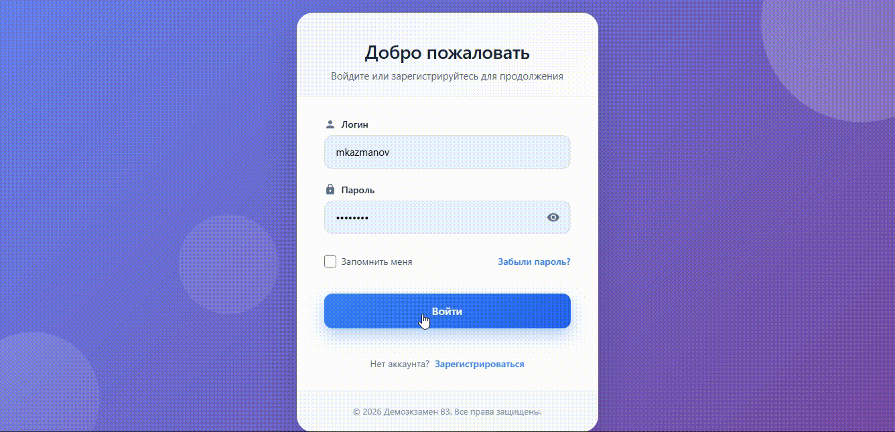
   
   
  
  

## О проекте

Это полноценное fullstack-приложение, разработанное в ходе сдачи демонстрационного экзамена. Проект демонстрирует навыки создания современного веб-приложения с использованием React на фронтенде и ASP.NET Core на бэкенде.

- Форма для создания нового пользователя с уникальным логином, паролем (мин. 6 символов), ФИО (только кириллица), телефоном в формате +7(XXX)-XXX-XX-XX и email. Все поля обязательны. По кнопке "Зарегистрироваться" данные сохраняются в базу.

- Форма входа для зарегистрированных пользователей по логину и паролю.

- Анкета для записи на тест-драйв. Содержит поля: адрес, контактные данные, желаемая дата/время, а также выбор марки и модели автомобиля из фиксированного списка (одна марка, несколько моделей). Все поля обязательны.

- Панель администратора. Отображает список всех заявок клиентов со всеми деталями. Администратор может менять статус заявки на "одобрено", "выполнено" или "отклонено".

### Интерфейс
- **Адаптивный дизайн** — корректное отображение на всех устройствах
- **Интерактивные компоненты** — модальные окна, уведомления, загрузка
- **Валидация форм** — на клиенте и сервере

## Скриншоты

  <table>
    <tr>
      <td>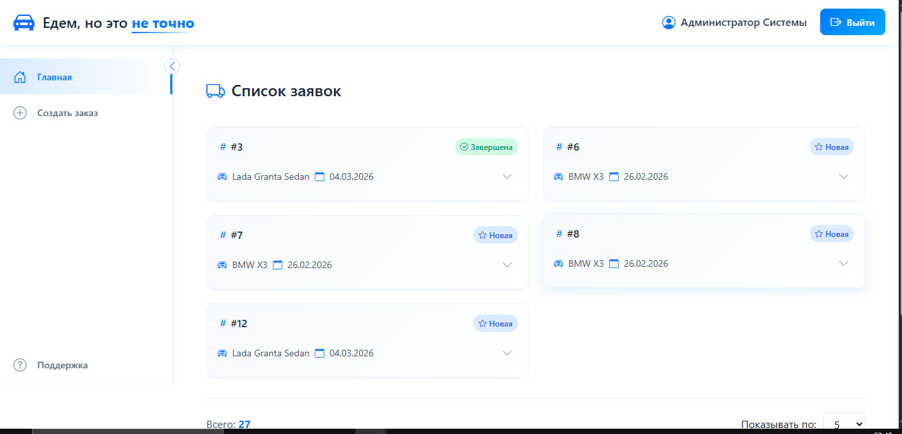</td>
      <td>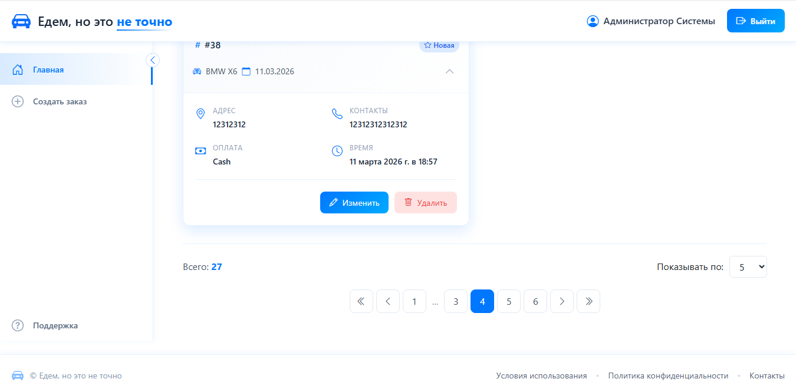</td>
    </tr>
    <tr>
      <td align="center">Главная страница</td>
      <td align="center">Главная страница2</td>
    </tr>
    <tr>
      <td>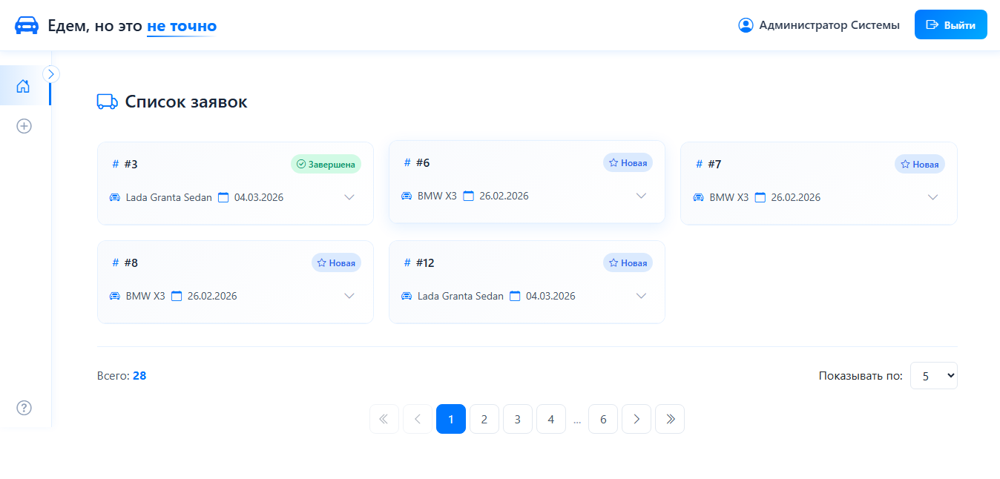</td>
    </tr>
    <tr>
      <td align="center">Главная страница3</td>
    </tr>
  </table>
  
  <table>
    <tr>
      <td>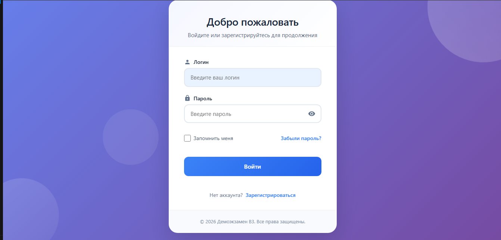</td>
      <td>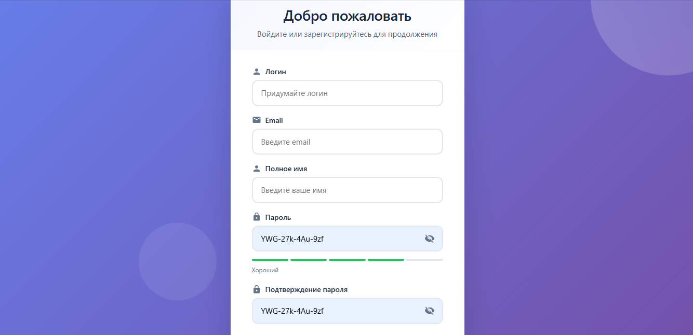</td>
    </tr>
    <tr>
      <td align="center">Логин</td>
      <td align="center">Регистрация</td>
    </tr>
  </table>
  
  <table>
    <tr>
      <td>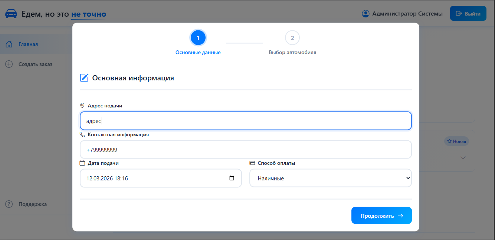</td>
      <td>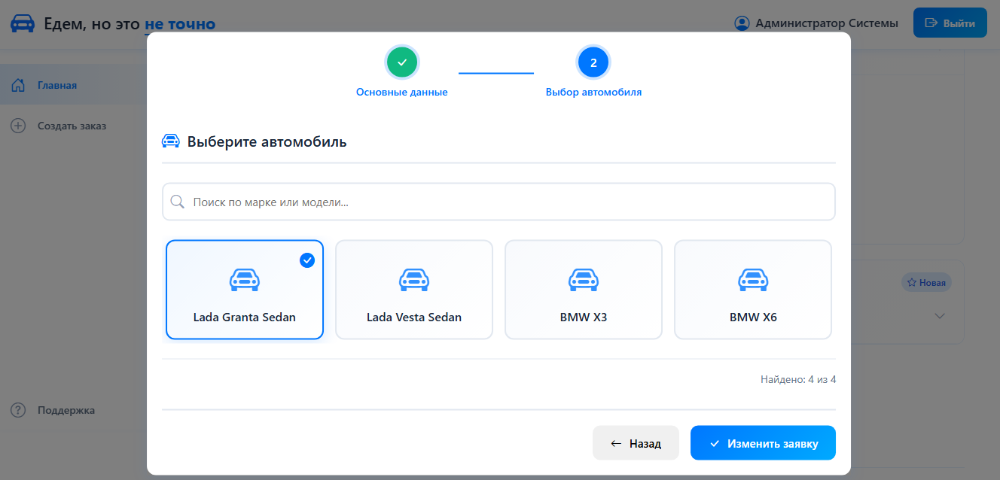</td>
    </tr>
    <tr>
      <td align="center">Изменить заявку шаг 1</td>
      <td align="center">Изменить заявку шаг 2</td>
    </tr>
  </table>

  <table>
    <tr>
      <td>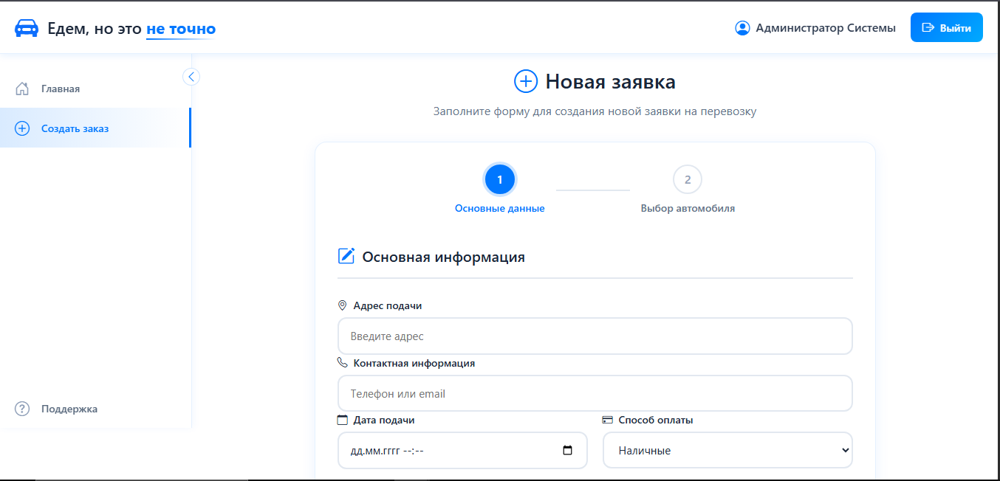</td>
      <td>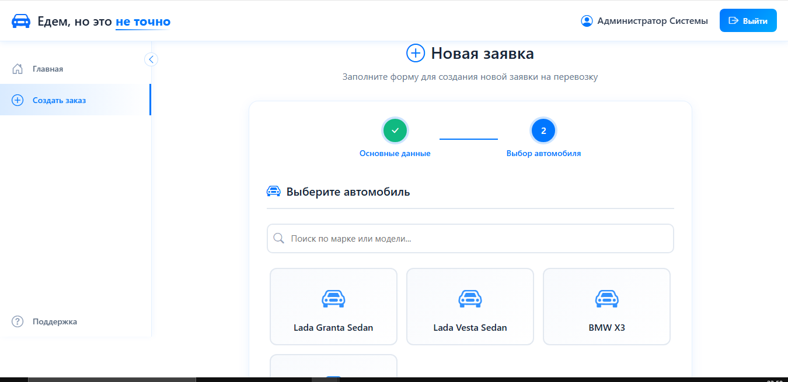</td>
    </tr>
    <tr>
      <td align="center">Добавить заявку шаг 1</td>
      <td align="center">Добавить заявку шаг 2</td>
    </tr>
  </table>

  <table>
    <tr>
      <td>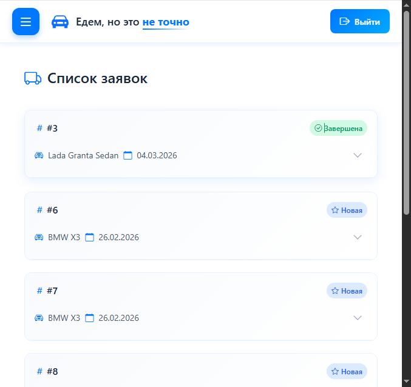</td>
      <td>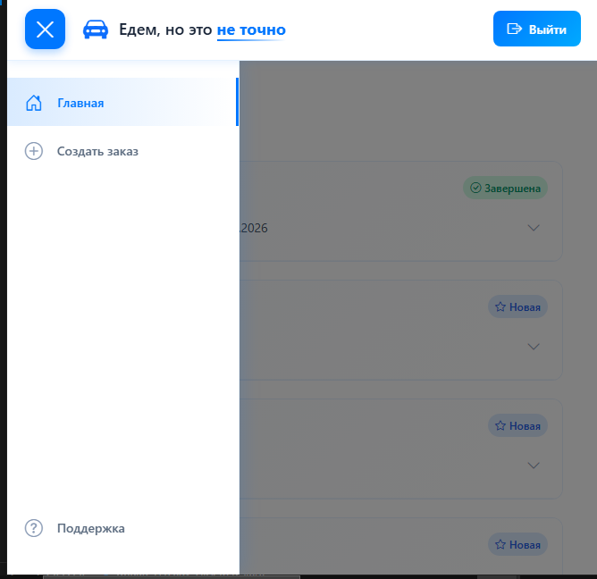</td>
    </tr>
    <tr>
      <td align="center">Главная страница</td>
      <td align="center">Главная страница2</td>
    </tr>
  </table>

